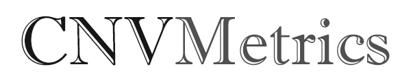
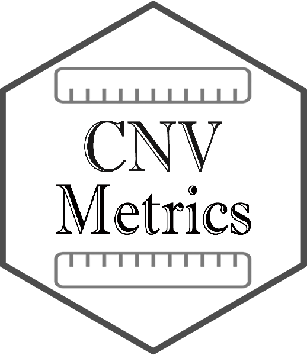

<!-- badges: start -->

<!-- badges: end -->

 

The **_CNVMetrics_** package offers multiple quantitative metrics of similarity between copy number profiles.
Among these are metrics based on CNV status calls only (amplification/deletion status) or on the level of amplification/deletion. In addition, a visualization tool is provided to explore resulting metrics.

## Citing ## 

If you use this package for a publication, we would ask you to cite the following:

>Belleau P, Deschênes A, Beyaz S et al. CNVMetrics package: Quantifying similarity between copy number profiles [version 1; not peer reviewed]. F1000Research 2021, 10:737 (slides) (doi: 10.7490/f1000research.1118704.1)

## Authors ##

[Astrid Desch&ecirc;nes](http://ca.linkedin.com/in/astriddeschenes "Astrid Desch&ecirc;nes"),
[Pascal Belleau](http://ca.linkedin.com/in/pascalbelleau "Pascal Belleau") and 
[Alexander Krasnitz](https://www.cshl.edu/research/faculty-staff/alexander-krasnitz/ "Alexander Krasnitz")

## Documentation ##

[CNVMetrics Website](https://krasnitzlab.github.io/CNVMetrics/)

[CNVMetrics Get Started](https://krasnitzlab.github.io/CNVMetrics/articles/CNVMetrics.html)

## Installation ##

To install the latest version accessible, the  [devtools](https://cran.r-project.org/web/packages/devtools/index.html) 
package is required.

     ## Load required package
     library(devtools)

     ## Install the latest version of CNVMetrics
     devtools::install_github('KrasnitzLab/CNVMetrics')

## License ##

This package and the underlying **_CNVMetrics_** code are distributed under 
the Artistic license 2.0. You are free to use and redistribute this software. 

For more information on Artistic 2.0 License see
[http://opensource.org/licenses/Artistic-2.0](http://opensource.org/licenses/Artistic-2.0)

## Bugs/Feature requests ##

If you have any bugs or feature requests, 
[let us know](https://github.com/KrasnitzLab/CNVMetrics/issues). 

Thanks!
