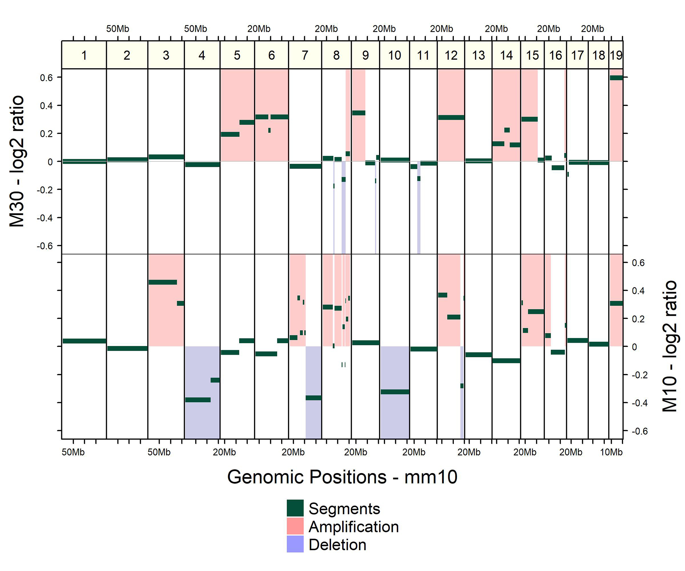
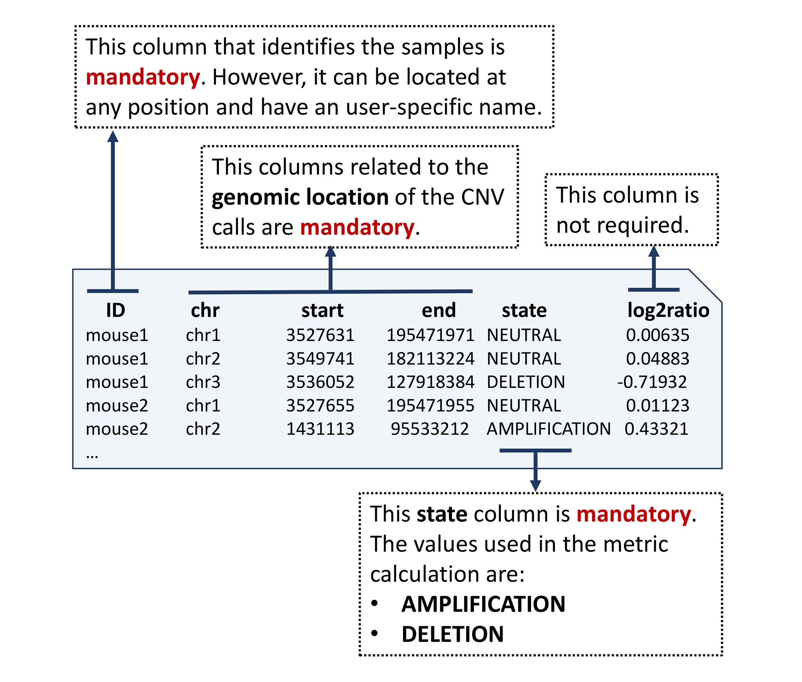
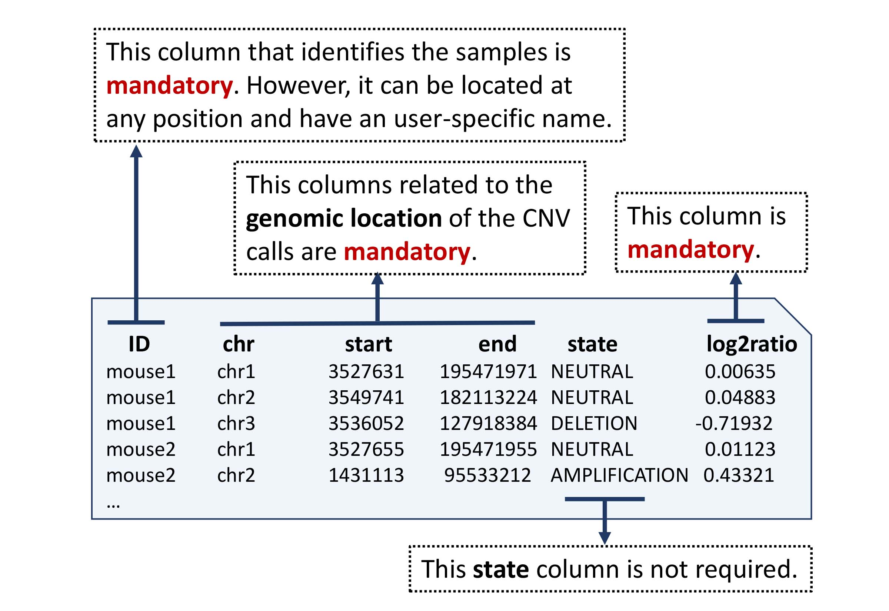

```{r style, echo = FALSE, results = 'asis', warning=FALSE, message=FALSE}
BiocStyle::markdown()

suppressPackageStartupMessages({
  library(knitr)
  library(GenomeInfoDb)
  library(GenomicRanges)
  library(CNVMetrics)
})

set.seed(121444)
```

<br />
**Package**: `r Rpackage("CNVMetrics")`<br />
**Authors**: `r packageDescription("CNVMetrics")[["Author"]]`<br />
**Version**: `r packageDescription("CNVMetrics")$Version`<br />
**Compiled date**: `r Sys.Date()`<br />
**License**: `r packageDescription("CNVMetrics")[["License"]]`<br />


# Licensing 

The `r Githubpkg("KrasnitzLab/CNVMetrics")` package and the underlying 
`r Githubpkg("KrasnitzLab/CNVMetrics")` code are distributed under the 
Artistic license 2.0. You are free to use and redistribute this software. 


<br>
<br>

# Citing

If you use this package for a publication, we would ask you to cite the following:

>Belleau P, Deschênes A, Beyaz S et al. CNVMetrics package: Quantifying similarity between copy number profiles [version 1; not peer reviewed]. F1000Research 2021, 10:737 (slides) (doi: 10.7490/f1000research.1118704.1)

[F1000Research poster](http://www.doi.org/10.7490/f1000research.1118704.1)

<br>
<br>

# Introduction

Copy number variation (CNV) includes multiplication and deletion of DNA
segment. Copy number variations have been shown to be associated 
with a wide spectrum of pathological conditions and complex traits, such 
as developmental neuropsychiatric disorders [@Hiroi2013] and especially 
cancer [@Stratton2009]. 

CNVs are usually reported, for each sample, as genomic regions that are 
duplicated or deleted with respect to a reference. Those regions are denoted 
as _CNV status calls_. The level of amplification or deletion can also be 
reported, usually in log2 ratio values or normalized read depth [@Zhao2013]. 
As an example, the Figure 1 shows the copy number profiles from sequencing 
data of two mouse pancreatic organoids [@Oni2020], calculated with 
`r Githubpkg("KrasnitzLab/CNprep")` [@Belleau2020] and plot with 
`r Biocpkg("gtrellis")` [@Gu2016a].


```{r graphCNVpro, echo = FALSE, fig.align="center", fig.cap="Copy number profiles of two mouse metastatic pancreatic organoids (M10 and M30).", out.width = '95%', results='asis'}

```

While visual representation is a practical way to qualitatively compare copy 
number profiles, metrics are useful statistical tools for quantitatively 
measuring similarity and dissimilarity between profiles. Similarity metrics 
can be employed to compare CNV profiles of genetically unrelated samples. 
Moreover, those metrics can as well be put to use on samples with common 
genetic background. As an example, a comparison between primary and metastatic 
tumor CNV profiles may reveal genomic determinants of metastasis. Similarly,
patient-derived xenograft or organoid models of cancer are expected to 
recapitulate CNV patterns of the tumor tissue of origin [@Gendoo2019].

The `r Githubpkg("KrasnitzLab/CNVMetrics")` package calculates metrics to 
estimate the level of similarity between copy number profiles. Some metrics 
are calculated using the _CNV status calls_ (amplification/deletion/LOH status
or any user specific status) while others are based on the level of 
amplification/deletion in log2 ratio. Finally, a visualization tool is 
provided to explore resulting metrics in the form of 
sample-to-sample heatmaps.

<br>
<br>

# Installation

To install the latest version accessible on the 
[CNVMetrics Github Website](https://github.com/KrasnitzLab/CNVMetrics "CNVMetrics Github Site"), 
the `r CRANpkg("devtools")` package is required.

```{r installDemo01, eval=FALSE}
## Load required package
library(devtools)

## Install the latest version of CNVMetrics
devtools::install_github('KrasnitzLab/CNVMetrics')
```

It is also possible to install an official release. The list of available 
releases is posted on the [CNVMetrics Release Website](https://github.com/KrasnitzLab/CNVMetrics/releases "CNVMetrics Release Site").


```{r installDemo02, eval=FALSE}
## Load required package
library(devtools)

## Install the version v0.1.4 of CNVMetrics
## using 'ref' parameter
devtools::install_github('KrasnitzLab/CNVMetrics', ref = "v0.1.4")
```

<br>
<br>

# Workflow for metrics calculated using _CNV status calls_

The following workflow gives an overview of the capabilities of 
`r Githubpkg("KrasnitzLab/CNVMetrics")` to calculate metrics using the 
_CNV status calls_ (amplification/deletion status or any user specific 
status):


The key functions for each step of the workflow are:

 Step                   | Function                    
----------------------- | ---------------------------------------------
 Data Importation       | `GenomicRanges::makeGRangesListFromDataFrame()`
 Metric Calculation     | `calculateOverlapMetric()`   
 Metric Visualization   | `plotMetric()`
 
The `package::function()` notation is used for functions from other packages.

## Data Input - Copy number file containing the _CNV status calls_

_CNV status calls_ are represented as segments with a copy number state. The 
state be general, such as "amplification", "deletion" or "neutral", or more 
specific such as of loss of heterozygosity (LOH), 1-copy gain, 2-copy gain, 
1-copy loss and so on.

A basic five-column input file containing genomic position 
(chromosome, start, end), sample identification and _CNV status calls_ is 
required. All samples that need to be analyzed together have to be combined 
into one file. 

A column named **state** is required. In this column, The _CNV status call_ of
each segment must be specified using a string. By default, the states that are
analyzed by this package are the amplification/deletion states with
this specific notation:

* **<span style="color:darkred">AMPLIFICATION</span>**
* **<span style="color:darkred">DELETION</span>**

Segments with other **state** values can be present in the file. However, 
those segments won't be retain for the calculation of the metrics.

However, the user can define is how notation and decided which **state** will
be used to calculate the similarity metrics. The user defined states can be
in upper or lower cases. Examples of possible states:


* **<span style="color:darkred">LOH</span>**
* **<span style="color:darkred">loh</span>**
* **<span style="color:darkred">1-copy gain</span>**
* **<span style="color:darkred">GAIN</span>**
* **<span style="color:darkred">loss</span>**
* and so on...

Beware that states with different spelling or upper/lower case nomenclature 
are considered as distinct states and are analyzed separately.

```{r figureCNVFile, echo = FALSE, fig.align="center", fig.cap="Example of a copy number file containing CNV calls.", out.width = '100%'}


```


## Data Importation - GRangesList

The input format for the copy number information, as needed by the 
`calculateOverlapMetric()` function, is a `GRangesList` object.

The easiest way to generate a `GRangesList` object is to first load the 
copy number information into an R `data.frame` and then, use the 
`GenomicRanges::makeGRangesListFromDataFrame()` function to convert them 
to a `GRangesList`.

For this demonstration, we consider _CNV status calls_ as obtained with 
`r Githubpkg("KrasnitzLab/CNprep")` [@Belleau2020], 
from ten mouse pancreatic organoids [@Oni2020]. 

```{r demoImport01}
## Load required libraries
library(GenomicRanges)
library(CNVMetrics)

## Load file containing CNV calls for 10 mouse organoids
data.dir <- system.file("extdata", package="CNVMetrics")
cnv.file <- file.path(data.dir, "mousePairedOrganoids.txt")
calls <- read.table(cnv.file, header=TRUE, sep="\t")

## The CNV status calls for all samples are present in one file
## The 'state' column is required
## The chromosome Y has been removed
head(calls)

## The ID column identifies the 10 samples
unique(calls[,"ID"])

## The ID column is used to split the samples into different GRanges 
## inside a GRangesList
## The 'keep.extra.column=TRUE' parameter is needed to retained the extra 
## column 'state' that is needed for the calculation of the metrics
grl <- GenomicRanges::makeGRangesListFromDataFrame(calls, 
    split.field="ID", keep.extra.columns=TRUE)
grl
```


## Metric Calculation

The calculation of the similarity metrics is done with the 
`calculateOverlapMetric()` function. 

```{r demoCalculateMetric01}
metric <- calculateOverlapMetric(grl, method = "sorensen")

metric
```

## Metric Visualization  

A heatmap of this similarity metrics can be a useful tool to get an overview 
over similarities and dissimilarities between samples.

The `plotMetric()` function generates a graphical representation of 
the similarity metrics in the form of a sample-to-sample heatmap. By default, 
an hierarchical clustering based on the sample distances 
(1-metrics) is used. When NA values are present in the metric matrix, those
are replaced by zero.

```{r demoPlot01, fig.align="center", fig.height=4.5, fig.width=4.5}
## Create graph for the metrics related to amplified regions
plotMetric(metric, type = "AMPLIFICATION")
```

<br>

<br>

The `plotMetric()` function uses the `r CRANpkg("pheatmap")` package to 
generate the graph. All arguments accepted by `pheatmap::pheatmap` function 
are valid arguments.

```{r demoPlot02, fig.align="center", fig.height=4.8, fig.width=4.8}
## Create graph for the metrics related to deleted regions
## Metric values are printed as 'display_numbers' and 'number_format' are
## arguments recognized by pheatmap() function
plotMetric(metric, type = "DELETION", 
                    colorRange=c("white", "darkorange"),
                    show_colnames=TRUE,
                    display_numbers=TRUE,
                    number_format="%.2f")
```

<br>
<br>

Row and/or column annotation is often useful and can easily be done 
by using the `annotation_row` or `annotation_col` arguments, as described in 
the `pheatmap::pheatmap` method.

```{r demoPlot03, fig.align="center", fig.height=4.8, fig.width=6}
## Load file containing annotations for the mouse organoids
## The mouse ID identifying the source of the sample
## The stage identifying the state (tumor vs metastasis) of the sample
data.dir <- system.file("extdata", package="CNVMetrics")
annotation.file <- file.path(data.dir, "mousePairedOrganoidsInfo.txt")
annotOrg <- read.table(annotation.file, header=TRUE, sep="\t")

## The row names must correspond to the names assigned to the rows/columns
## in the CNVMetric object
rownames(annotOrg) <- annotOrg$ID
annotOrg$ID <- NULL
all(rownames(annotOrg) == rownames(metric$AMPLIFICATION))

## Create graph for the metrics related to amplified regions
## Rows are annotated with the stage and mouse information
plotMetric(metric, type = "AMPLIFICATION", 
                    colorRange=c("white", "steelblue"),
                    annotation_row=annotOrg)
```

<br>
<br>

# Metrics using the _CNV status calls_

This survey represents the overlap metrics that are implemented in 
`r Githubpkg("KrasnitzLab/CNVMetrics")` package. Those metrics are calculated 
using the _CNV status calls_. The size of the amplified/deleted regions as 
well as the size of the overlapping of regions are always in base paired. 

## Sørensen

The Sørensen coefficient [@Sorensen48] is calculated by dividing twice the 
size of the intersection by the sum of the size of the two sets:

\begin{equation}
  \frac{2\times  \left| X \cap Y \right| }{\left| X \right| + \left| Y \right|}
  (\#eq:sorensen)
\end{equation}    

where $X$ and $Y$ represent the regions of each sample in base paired.

## Szymkiewicz–Simpson

The Szymkiewicz–Simpson coefficient [@Vijaymeena2016], also known as the 
overlap coefficient, is calculated by dividing the size of the intersection 
by the smaller of the size of the two sets:

\begin{equation}
  \frac{\left| X \cap Y \right|}{min \left(\left| X \right|,\left| Y \right|\right)}
  (\#eq:szymkiewicz)
\end{equation}    

where $X$ and $Y$ represent the regions of each sample in base paired. If 
set $X$ is a subset of $Y$ or vice versa, the overlap coefficient 
value is 1. 


## Jaccard

The Jaccard coefficient [@Jaccard1912], also known as coefficient of 
community, is calculated by dividing the size 
of the intersection by the smaller of the size of the two sets:

\begin{equation}
  \frac{\left| X \cap Y \right| }{ \left| X \cup Y \right|}
  (\#eq:jaccard)
\end{equation}    

where $X$ and $Y$ represent the regions of each sample in base paired.

<br>
<br>

# Workflow for metrics calculated using _the level of amplification/deletion_

The following section gives an overview of the capabilities of 
`r Githubpkg("KrasnitzLab/CNVMetrics")` to calculate metrics using the 
_the level of amplification/deletion_ (log2 ratio values):

The key functions for each step of the workflow are:

 Step                   | Function                    
----------------------- | ---------------------------------------------
 Data Importation       | `GenomicRanges::makeGRangesListFromDataFrame()`
 Metric Calculation     | `calculateLog2ratioMetric()`   
 Metric Visualization   | `plotMetric()`
 
The `package::function()` notation is used for functions from other packages.


## Data Input - Copy number file containing _the level of amplification/deletion_ 

Copy number are often represented as segments with a copy number state and/or
the level of amplification/deletion. One usual unit to quantify the level 
of amplification or deletion is in log2 ratio. 

A basic five-column input file containing genomic position 
(chromosome, start, end), sample identification and 
_the level of amplification/deletion_ is 
required. All samples that need to be analyzed together have to be combined 
into one file. 

A column named **log2ratio** is required. In this column, the amplified and 
deleted segments must be assigned a numerical value representing the log2ratio
or NA.

```{r figureCNVFileLog2Ratio, echo = FALSE, fig.align="center", fig.cap="Example of a copy number file containing log2ratio values.", out.width = '100%'}


```


## Data Importation - GRangesList

The input format for the copy number information, as needed by the 
`calculateLog2ratioMetric()` function, is a `GRangesList` object.

The easiest way to generate a `GRangesList` object is to first load the 
copy number information into an R `data.frame` and then, use the 
`GenomicRanges::makeGRangesListFromDataFrame()` function to convert them 
to a `GRangesList`.

For this demonstration, we consider _the level of amplification/deletion_ as 
obtained with `r Githubpkg("KrasnitzLab/CNprep")` [@Belleau2020], 
from ten mouse pancreatic organoids [@Oni2020]. 

```{r demoImport02}
## Load required libraries
library(GenomicRanges)
library(CNVMetrics)

## Load file containing CNV calls for 10 mouse organoids
data.dir <- system.file("extdata", package="CNVMetrics")
cnv.file <- file.path(data.dir, "mousePairedOrganoids.txt")
calls <- read.table(cnv.file, header=TRUE, sep="\t")

## The CNV status calls for all samples are present in one file
## The 'log2ratio' column is required
## The chromosome Y has been removed
head(calls)

## The ID column identifies the 10 samples
unique(calls[,"ID"])

## The ID column is used to split the samples into different GRanges 
## inside a GRangesList
## The 'keep.extra.column=TRUE' parameter is needed to retained the extra 
## column 'state' that is needed for the calculation of the metrics
grlog <- GenomicRanges::makeGRangesListFromDataFrame(df=calls, 
    split.field="ID", keep.extra.columns=TRUE)
grlog
```


## Metric Calculation

The calculation of the similarity metrics is done with the 
`calculateOverlapMetric()` function. 

```{r demoCalculateMetricLog}
metricLog <- calculateLog2ratioMetric(segmentData=grlog, 
                              method="weightedEuclideanDistance")

metricLog
```

## Metric Visualization  

A heatmap of this similarity metrics can be a useful tool to get an overview 
over similarities and dissimilarities between samples.

The `plotMetric()` function generates a graphical representation of 
the similarity metrics in the form of a sample-to-sample heatmap. By default, 
an hierarchical clustering based on the sample distances 
(1-metrics) is used. When NA values are present in the metric matrix, those
are replaced by zero.

```{r demoPlotLog01, fig.align="center", fig.height=4.5, fig.width=4.5}
## Create graph for the metrics related to weighted Euclidean distance-based
plotMetric(metricLog)
```

<br>

The `plotMetric()` function uses the `r CRANpkg("pheatmap")` package to 
generate the graph. All arguments accepted by `pheatmap::pheatmap` function 
are valid arguments.

```{r demoPlotLog02, fig.align="center", fig.height=4.8, fig.width=4.8}
## Create graph for the weighted Euclidean distance-based metrics
## Remove title (argument main="")
## Metric values are printed as 'display_numbers' and 'number_format' are
## arguments recognized by pheatmap() function
plotMetric(metricLog, colorRange=c("white", "darkorange"),
                    show_colnames=TRUE,
                    display_numbers=TRUE,
                    number_format="%.2f",
                    main="")
```

<br>
<br>

# Metrics using the level of amplification/deletion

This survey represents the similarity measure that is implemented in 
`r Githubpkg("KrasnitzLab/CNVMetrics")` package. This metric are calculated 
using the level of amplification/deletion. The level of 
amplification/deletion is in log2 ratio while the size of the regions 
is in base paired. 

## Weighted Euclidean Distance-Based

The Weighted Euclidean Distance corresponds to the euclidean distance between
the log2 values of the two samples multiplied by the natural logarithm 
of the number of bases of the analyzed segments. The final metric is 1 over
1 added to the squared sum of the values obtained for all segments included 
in the calculation.


\begin{equation}
  \frac{1}{1 + \sqrt{\sum_{i=1} log_{2}(w_{i}) (A_{i} - B_{i})^{2}}}
  (\#eq:euclidean)
\end{equation}  

where $A_{i}$ and $B_{i}$ represent the log2 ratio values of samples $A$ and 
$B$ for the region $i$ while $w_{i}$ is the length of region $i$ in base 
paired.

<br>
<br>

# Supplementary information

## Creating your own GRangesList

The `GenomicRanges::makeGRangesListFromDataFrame()` function enables the 
creation of a list of `GRangesList` objects from a `data.frame`. However, 
`GRangesList` can also be generated and filled manually. 

```{r demoGR}
## Construction a GRangesList()
gr1 <- GRanges(seqnames="chr2", ranges=IRanges(3, 6000),
          strand="+", state="AMPLIFICATION", 
          log2ratio=0.45)
gr2 <- GRanges(seqnames=c("chr1", "chr2"),
          ranges=IRanges(c(7,5555), width=c(1200, 40)),
          strand=c("+", "-"),  state=c("NEUTRAL", "AMPLIFICATION"), 
          log2ratio=c(0.034, 0.5))
gr3 <- GRanges(seqnames=c("chr1", "chr2"),
          ranges=IRanges(c(1, 5577), c(3, 5666)),
          strand=c("-", "-"), state=c("NEUTRAL", "AMPLIFICATION"), 
          log2ratio=c(0.04, 0.31))

grl <- GRangesList("sample01"=gr1, "sample02"=gr2, "sample03"=gr3)
```

<br>
<br>

# Session info

Here is the output of `sessionInfo()` on the system on which this document was 
compiled:

```{r sessionInfo, echo=FALSE}
sessionInfo()
```

<br>
<br>

# References


