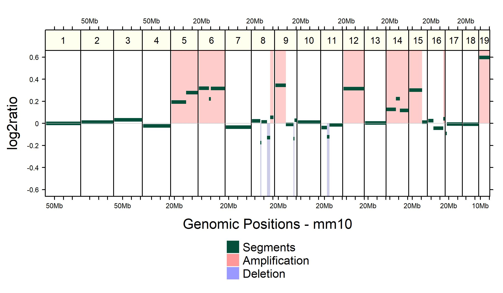

```{r style, echo = FALSE, results = 'asis', warning=FALSE, message=FALSE}
BiocStyle::markdown()
library(knitr)
library(GenomeInfoDb)

```

<br />
**Package**: `r Rpackage("CNVMetrics")`<br />
**Authors**: `r packageDescription("CNVMetrics")[["Author"]]`<br />
**Version**: `r packageDescription("CNVMetrics")$Version`<br />
**Compiled date**: `r Sys.Date()`<br />
**License**: `r packageDescription("CNVMetrics")[["License"]]`<br />


# Licensing 

The `r Githubpkg("adeschen/CNVMetrics")` package and the underlying 
`r Githubpkg("adeschen/CNVMetrics")` code are distributed under the 
Artistic license 2.0. You are free to use and redistribute this software. 

# Introduction

Copy number variation (CNV) includes multiplication and deletions of DNA
segment (> 1 kb). Copy number variations have been shown to be associated 
with a wide spectrum of pathological conditions and complex traits, such 
as developmental neuropsychiatric disorders [@Hiroi2013] and especially 
cancer [@Stratton2009]. 

CNV are usually reported, for each sample, as genomic regions that are 
duplicated or deleted with respect to a reference. Those regions are denoted 
as _CNV calls_. The level of amplification or deletion can also be reported, 
usually in log2 ratio values or normalized read depth [@Zhao2013]. As an 
example, the Figure 1, the copy number profile obtained with 
`r Githubpkg("KrasnitzLab/CNprep")` [@Belleau2020] from sequencing data of 
mouse pancreatic organoid [@Oni2020] and plot with 
`r Biocpkg("gtrellis")` [@Gu2016a].

{ width=100% }

The `r Githubpkg("adeschen/CNVMetrics")` package calculates metrics to 
estimate the level of similarity between copy number profiles. Some metrics 
are calculated using the _CNV calls_ (amplification/deletion status) while 
others use the level of amplification/deletion.


# Metrics using the _CNV calls_

This survey represents the similarity measures that are implemented in 
`r Githubpkg("adeschen/CNVMetrics")` package. Those metrics are calculated 
using the _CNV calls_. The size of the amplified/deleted regions as well as 
the size of the overlapping of regions are always in base paired. 

## Sørensen


The Sørensen coefficient [@Sorensen48] is calculated by dividing twice the  
size of the intersection by the sum of the size of the two sets:

\begin{equation}
  \frac{2\times  \left| X \cap Y \right| }{\left| X \right| + \left| Y \right|}
  (\#eq:sorensen)
\end{equation}    


## Szymkiewicz–Simpson

The Szymkiewicz–Simpson coefficient [@Vijaymeena2016], also known as the 
overlap coefficient, is calculated by dividing the size of the intersection 
by the smaller of the size of the two sets:

\begin{equation}
  \frac{\left| X \cap Y \right| }{min \left(\left| X \right| , \left| Y \right|\right)}
  (\#eq:szymkiewicz)
\end{equation}    

If set **X** is a subset of **Y** or vice versa, the overlap coefficient 
value is 1. 


# Metrics using the level of amplification/deletion

This survey represents the similarity measures that are implemented in 
`r Githubpkg("adeschen/CNVMetrics")` package.

TODO


# Inputs

## Chromosomes information 

The chromosomes information is mandatory. It ensures that only the selected
chromosomes are used in the analysis. As not all CNV software use the same
reference (reference with alternative regions or not), it ensure that
all samples will be compared using the same reference. We strongly encourage 
using only the primary chromosomes for this analaysis.

The chromosomes information is contained inside a `Seqinfo` object. The 
information from some UCSC genomes can be fetched automatically using
the `r Biocpkg("GenomeInfoDb")` package. 

```{r knownGenome, collapse=TRUE, eval=FALSE, message=FALSE, warning=FALSE}
### Import needed library that contains the Seqinfo method
library(GenomeInfoDb)

### Get the information for Human genome version GRCh38
hg38Info <- Seqinfo(genome="hg38")

### Subset the object to keep only the analyzed chromosomes
### Chromosomes X and Y are often removed from subsequent analyses
seqlevels(hg38Info) <- paste0("chr", 1:22)
```

A `Seqinfo` object can also be created using the chromosomes information 
specific to the analyzed genome. The `r Biocpkg("GenomeInfoDb")` package is
required.

```{r newGenome, collapse=FALSE}
### Import needed library that contains the Seqinfo method
library(GenomeInfoDb)

### Create an Seqinfo Object
chrInfo <- Seqinfo(seqnames=c("chr1", "chr2", "chr3"),
            seqlengths=c(10000, 20000, 1500), isCircular=c(FALSE, FALSE, FALSE),
            genome="Alien")
```

```{r deleteChr, echo=FALSE, message=FALSE}
if (exists("chrInfo", inherits = FALSE)) rm(chrInfo)
if (exists("hg19Subset", inherits = FALSE)) rm(hg19Subset)
if (exists("hg19Info", inherits = FALSE)) rm(hg19Info)
```


```{r demo}
#a<-prepareInformation(segDirectory = "inst/extdata/", bedExclusionFile = "inst/extdata/exclusion.bed", segmentWithHeader = FALSE, chrInfo = hg38Info)

```


# Session info

Here is the output of `sessionInfo()` on the system on which this document was 
compiled:

```{r sessionInfo, echo=FALSE}
sessionInfo()
```


# References


